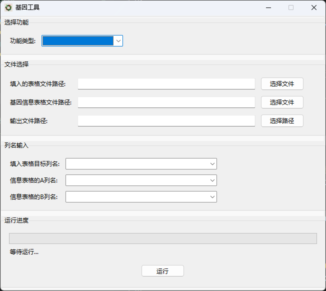

# 基因工具程序使用说明书

## 一、程序概述
**基因工具**是一款基于 Python 的 Excel 数据处理工具，专为生物信息和基因分析设计。程序提供**基因查询、基因匹配、递归匹配**等功能，并可自动处理 Excel 表格数据，支持横向/竖向排列、模糊匹配、进度显示和结果保存提示。

---

## 二、主要功能

### 1. 功能选择
- **基因查询**：从基因信息表中查询填入表格对应基因的信息，支持批量处理。
- **基因匹配**：
  - **横向排列**：按行匹配，将查询结果横向插入填入表格。
  - **竖向排列**：按列匹配，将查询结果纵向插入填入表格。
  - **模糊匹配**：启用后可进行近似匹配，适用于基因名称不完全一致的情况。

### 2. 文件选择
- **填入的表格文件**：用户提供的需要补充信息的 Excel 表格。
- **基因信息表格文件**：存放完整基因信息的 Excel 表格。
- **输出文件路径**：指定生成的 Excel 文件保存路径。

### 3. 列名选择
- **填入表格目标列**：选择需要补充信息的列名。
- **信息表格的 A、B 列名**：选择信息表格中对应的列名，用于匹配或查询。

### 4. 运行进度显示
- 程序在运行过程中会显示：
  - **进度条**：显示当前任务完成百分比。
  - **状态栏**：显示运行状态（如“正在运行…”、“操作完成”）。

### 5. 操作完成提示
- 文件保存成功后，程序会弹出提示窗口，显示保存路径。
- 用户可选择：
  - **Yes**：用系统默认 Excel 打开新生成的文件。
  - **No**：仅提示，不打开文件。

---

## 三、操作步骤

1. **启动程序**
   - 通过 Python 运行 'main.py' 启动程序或者执行 'build_exe.bat' 创建exe程序。
   - 程序界面包含四个主要模块：
     1. 功能选择
     2. 文件选择
     3. 列名输入
     4. 运行进度

2. **选择功能**
   - 在“功能类型”下拉菜单中选择：
     - **基因查询**
     - **基因匹配**
   - 如果选择“基因匹配”，会显示排列方式和模糊匹配选项：
     - 排列方式：横向 / 竖向
     - 模糊匹配：勾选启用

3. **选择文件**
   - 点击“选择文件”按钮，选择：
     - 填入表格文件（Excel）
     - 基因信息表格文件（Excel）
   - 点击“选择路径”，设置输出 Excel 文件保存位置

4. **选择列名**
   - 从下拉框选择填入表格目标列名
   - 选择信息表格的 A 列和 B 列

5. **运行操作**
   - 点击“运行”按钮，程序开始处理数据
   - 运行过程中：
     - **进度条**会显示当前任务完成进度
     - **状态栏**会显示当前状态

6. **查看结果**
   - 运行完成后，弹窗提示文件保存路径
   - 可选择：
     - **Yes**：直接用系统默认 Excel 打开
     - **No**：不打开，仅提示路径

---

## 四、注意事项

1. 文件必须为 **Excel 文件（.xlsx）**，否则无法读取。
2. 列名必须与 Excel 文件中的列完全一致（注意大小写）。
3. 输出文件路径需指定有效路径，若文件已存在将被覆盖。
4. 模糊匹配可能会导致部分不完全一致的基因被匹配，请根据需求选择。
5. Windows 系统支持直接打开 Excel 文件；macOS 和 Linux 系统需要系统默认程序支持打开 `.xlsx` 文件。
6. 若程序报错，请确保已安装：
   - Python 3.8 或以上
   - pandas
   - openpyxl

---

## 五、界面说明

1. **功能模块**
   - **选择功能**：设置操作类型和匹配模式
   - **文件选择**：选择输入文件和输出路径
   - **列名输入**：选择对应列名
   - **运行进度**：显示运行状态和进度条

2. **状态提示**
   - **等待运行…**：程序空闲状态
   - **正在运行…**：数据处理过程中
   - **操作完成**：处理完成，可查看生成文件
   - **运行出错**：出现异常，可根据提示检查

---

## 六、示例场景

1. **基因查询**
   - 填入表格包含基因 ID
   - 基因信息表包含基因描述和功能
   - 程序自动将信息填入填入表格，生成新 Excel 文件

2. **基因匹配**
   - 填入表格包含部分基因 ID
   - 信息表包含更多信息
   - 横向匹配：在同一行补充信息
   - 竖向匹配：在同一列补充信息
   - 启用模糊匹配可处理拼写不完全一致的基因

---

## 七、常见问题

| 问题 | 解决方案 |
|------|---------|
| 程序无法读取 Excel | 确认文件为 .xlsx 格式，且未被其他程序占用 |
| 列名未显示 | 确认 Excel 文件第一行是列名，且已选择正确文件 |
| 文件保存失败 | 检查输出路径是否有写权限 |
| 打开文件失败 | Windows 系统需要默认 Excel 安装；macOS/Linux 需默认支持打开 .xlsx |

---

## 八、版本信息

- **程序名称**：基因工具  
- **版本**：V1.1.1.1  
- **开发环境**：Python 3.8+  
- **依赖库**：pandas, openpyxl, tkinter  
- **开发者**：海是天空的颜色  

---

如有建议或问题，欢迎反馈。邮箱：[522723song@gmail.com](mailto:522723song@gmail.com)
